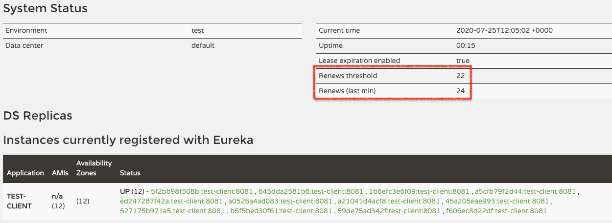
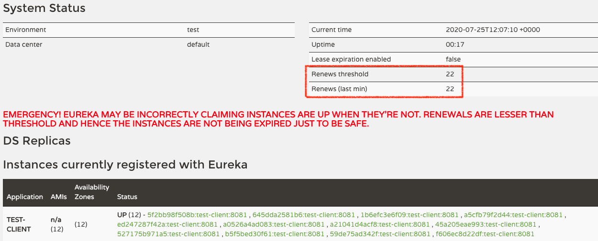
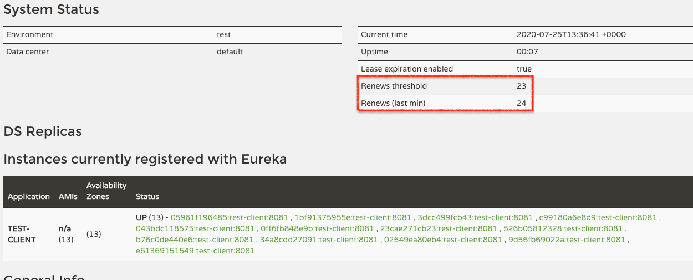
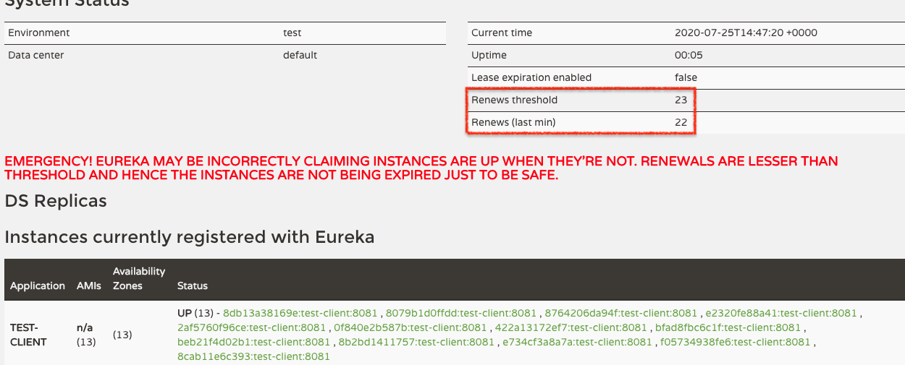

Eureka 是 Spring Cloud Netflix 的服务注册与发现工具。一般情况下，它都能很好的工作，但有时却会出现一些匪夷所思的情况。
今天我们就来研究一下不当的配置导致的幽灵服务。

# 幽灵出现

我们先来给幽灵服务做一个定义：它们是 Eureka 注册表中的一些节点，但是它们实际上已经被关闭了，永远无法访问。

我们可以通过 `GET /eureka/apps` 获取 Eureka 中注册的节点信息，其中包含了节点的最后更新时间： lastRenewalTimestamp 。如果发现这个时间已经过去了很久，那么这个节点可能就是一个幽灵节点。

这其实是一个非常反常的现象，因为 Eureka client 在关闭时，通过 `@PreDestroy` 触发 `DiscoveryClient.shutdown()` 方法，向 Eureka Server 发送 shutdown 请求，从 Eureka Server 注册表中注销。

那么问题来了。

# 为什么这些服务没有注销？

因为 `@PreDestroy` 是用来处理 `SIGTERM` 等信号的，所以只有在通过这些信息关闭 Eureka client 时，Eureka client 才会向 Eureka Server 发送 shutdown 请求。
但是如果是通过 `kill -9` 这样的指令，或者是 [不优雅的 stop docker](../graceful-shutdown-docker-container/) ，即发送 `SIGKILL` 信号，都不会触发 `PreDestroy`，那么这些 Eureka client 也就不会被注销了。

那么问题又来了。

# 难道 Eureka 不会清理过期的注册信息吗？

其实是会的。

在 Eureka Server 的核心库 `eureka-core` 中，有一个 `AbstractInstanceRegistry` 类，其中实现了 `evict()` 方法，用来完成清理过期注册信息的工作。这个方法被一个 `TimerTask` 定时调用，默认间隔时间是 60s。

在这个方法中，Eureka server 会：

1. 找到所有过期的 `Lease` (对应一个 Eureka client 节点)
2. 通过本地注册的 `Lease` 数量和一个阈值 *(后面还有戏份)* 计算出一个 evictonLimit 数值
3. 比较过期的 `Lease` 数量和 evictionLimit 的大小，选出小的那个数作为本次清理的数量
4. 从过期的 `List<Lease>` 中随机挑出 n 个 `Lease`，删除 (这里的 n 就是上一步的结果)

这里的阈值通过 `eureka.server.renewal-percent-threshold` 设置，默认值是 0.85。

后面限制每次清理节点数量的算法，只是一种性能优化的考虑。如果忽略掉这部分的逻辑，我们可以认为，一个节点长时间没有向 Eureka server 发送心跳请求，那么它的 `Lease` 就会过期，最终被定时任务清楚掉。

因为默认的租期时间是 90s，evict 周期是 60s，所以一个服务被不优雅的关闭后，最多经过 120s 就可以被清理出注册表。

但是 eureka 在这里却有一个 [bug](https://github.com/Netflix/eureka/issues/531)。Eureka server 在接收到心跳请求时，会把当前时间加上租期时间作为最后接收到心跳的时间。然后在清理时，又会在这个时间上再加一个租期时间来判断是否过期。所以一个服务过期时间总共是 180s，它被不优雅的关闭后最多经过 240s 就会被清理掉。

但是事情可能没有那么简单，别说 240s，就是过了两天，这些幽灵服务可能还在你的注册表里。

这就涉及到另一个问题，Eureka server self-preservation mode.

# 自我保护模式

## 概念

Eureka client 之间调用时，不会向 Eureka server 发送任何请求，而是根据本地维护的注册表，找到需要调用的服务，直接调用，也就是 peer to peer 的模式。本地的注册表，其实是从 Eureka server 拉取回来的，默认每 30s 拉取一次更新。
那么当 Eureka server 因为网络震荡没有接收到某些 Eureka client 发送的心跳请求时，并不意味着 Eureka client 之间的网络也出现了问题，Eureka client 之间可能仍然能够访问。
如果这个时候更新注册表，清理了只是因为网络震荡而没有发送心跳的节点，那么本可能成功的调用就会失败。
为了减少对服务的影响，Eureka 默认启动了自我保护模式，不会清理掉过期的注册信息。

官方详细的解释可以看[这里](https://github.com/Netflix/eureka/wiki/Server-Self-Preservation-Mode)。

## 自我保护的逻辑

在上面介绍的 `evict` 方法的逻辑之前，eureka 会首先调用 `isLeaseExpirationEnabled` 方法，以判断是否要执行后续的清理逻辑。

这个方法首先会判断是否启用了自我保护模式，如果没有启用，那么就返回 `true`，否则会返回下面这个表达式的结果。

```
number-of-renews-per-min-threshold > 0 
  && num-of-renews-in-last-min > number-of-renews-per-min-threshold
```

那么接下来我们就看看这两个值是什么。

### Number of Renews in Last Minute

这个值的含义顾名思义，就是过去一分钟内，eureka server 接收到的心跳请求次数。这不是实时数据，而是每分钟更新一次。具体逻辑被 `MeasureRate` 实现。

由于 eureka client 默认配置的心跳间隔是 30s，所以这默认情况下的这个值就是 `2*client-size`。

### Number of Renews per Minute Threshold

这个值就相对复杂一些，表示的是触发自我保护模式的心跳阈值。根据表达式，就明白它的含义：当过去一分钟实际接收到的心跳总数小于等于这个心跳阈值时，就会触发自我保护模式，Eureka server 就不会清理注册信息。

接着，我们来看看这个阈值是如何计算出来的：

```
(int) (expected-number-of-clients-sending-renews 
  * (60.0 / expected-client-renewal-interval-seconds)
  * renewal-percent-threshold)
```

好了，这里又冒出来三个值，我们先来看看后两个。

#### Expected Client Renewal Interval Seconds

这是一个配置的值，默认 30s，通过 `eureka.server.expected-client-renewal-interval-seconds` 配置。

需要注意的是，这个值不是 client 真实的发送心跳的时间间隔，真实的心跳间隔是值 client 中配置的 `eureka.instance.lease-renewal-interval-in-seconds`，同样默认 30s。

但这两个值显然应该保持一致，因为上面的 number-of-renews-in-last-min 其实就是 `(60 / lease-renewal-interval-in-seconds) * client-size`，而这里也几乎是同样的逻辑（如果把 expected-number-of-clients-sending-renews 看作 `client-size` 的话）。

#### Renewal Percent Threshold

这个值在前面讲清理注册信息的时候已经讲过了，默认值 0.85。

#### Expected Number of Clients Sending Renews

根据名字，这个值代表的是期望的会发送心跳请求的 client 数量，也就是前面的 `client-size`。但是实际上的值却有可能不同。

这个值的一个更新时间是启动 eureka server 时。Eureka server 会尝试从配置的邻居 server 节点拉取注册表信息来配置。如果没有邻居节点，或者注册表中没有信息的话，就会被设置为默认值 1，通过 `eureka.server.defaultOpenForTrafficCount` 配置。

> 不是很明白为什么要设置默认值为 1。不过相关代码中，在注册与注销时，都只有在这个值大于 0 时才会更新。

这个值的另一个更新时间是一个定时任务，默认每 15min 执行一次。可以通过 `eureka.server.renewal-threshold-update-interval-ms` 修改这个时间。

最后，每当这个值被更新之后，都会更新我们的心跳阈值。

了解了上面的这些逻辑，我们了解到，如果符合 `应有的心跳数 - 失去的心跳数 ≤ 心跳阈值`，那么就会触发自我保护机制。

## 处理一个幽灵服务的极限值

了解了前面这些，我不禁产生一个疑问：在默认配置的情况下，有多少个 client 之后，eureka server 才会清理掉过期的注册信息？出现多少个过期的注册信息，就会触发自我保护模式？

这其实只是一个数学问题。假设集群中一共有 n 个 client，eureka server 能接受的不会触发自我保护模式的过期注册信息个数有 m 个，那么我们就可以有如下的推导：

```
threshold = (n + default-open-for-traffic-count) * (60 / expect-client-renewal-interval-second) * renewal-percent-threshold
// 带入默认的配置之后
=> threshold = (n + 1) * (60 / 30) * 0.85 = 1.7(n + 1)
// 因为每 30s 发送一次心跳，所以 n 个服务就应该有 2n 个心跳， m 个幽灵服务就会失去 2m 个心跳
2n - 2m ≤ 1.7(n + 1)
=> 2n - 1.7(n + 1) ≤ 2m
=> 0.15n - 0.85 ≤ m
```

所以，一个集群如果要能够处理一个过期的注册信息，也就是 m=1， 那么至少需要有多于 12.33 个 eureka client，也就是 13 个。
换句话说，在默认配置下，如果集群中只有不到 13 个服务，那么任何一个服务被不优雅的关闭，都会出现幽灵服务。

### 验证

为了验证上面的结论，我写了个 [demo](https://github.com/kbyyd24/eureka-self-preservation-verify) 来验证一下。

> 为了保证每分钟的 `evict` 方法都用到最新的心跳阈值，我把 `expected-number-of-clients-sending-renews` 的更新时间设置为了 60s。

> 这个 demo 用了 docker-compose，验证的步骤需要启动 14 个 container，想要试试的同学需要给自己的 docker 多分配点资源。

#### 12 个 client 会触发自我保护模式

话不多说，直接启动

```shell
docker-compose up -d eureka-clinet=12
```

稍等一会儿，访问 http://localhost:8080 就可以在 eureka 的页面上看到两个值：

- Renews threshold: 22
- Renews (last min): 24



这两个值都符合上面的数学计算。

然后，随便杀掉一个 client (一定要使用 docker kill，避免 client 发送 shutdown 请求):

```shell
docker kill eureka-self-preservation-verify_eureka-client_1
```

然后几分钟过去了，eureka server 的注册服务仍然有 12 个。



#### 13 个 client 能够处理掉一个幽灵服务

还是上面的命令，只是这次我们启动 13 个 eureka-client


然后也是随便杀掉一个 client，等待结果。

被杀掉的节点被清理前：



被杀掉的节点被清理后：


还可以观察一下杀掉两个 client 的效果：



同时，也可以利用 `GET /eureka/apps` 查看注册信息，关注被杀掉的节点的 lastRenewalTimestamp 信息。这是它的最后注册时间，因为加了 90s，所以应该是一个未来的时间。用这个时间加上 90s，在这之后的第一次 `evict` 就应该清理掉这个节点信息，这可以在 eureka-server 的日志中看到。

# 总结

我们研究了 eureka 的自我保护模式，它的目的是避免在出现网络震荡时删除掉可能正常工作的节点信息。但如果配置不当，自我保护模式反而可能产生幽灵服务。

可以影响到自我保护模式的配置主要有两个：

- `eureka.server.enable-self-preservation` 默认为 `true`
- `eureka.server.renewal-percent-threshold` 默认为 0.85

根据实际的情况，我们可能需要直接关闭自我保护模式，或者找出一个更适合具体情况的 threshold。

