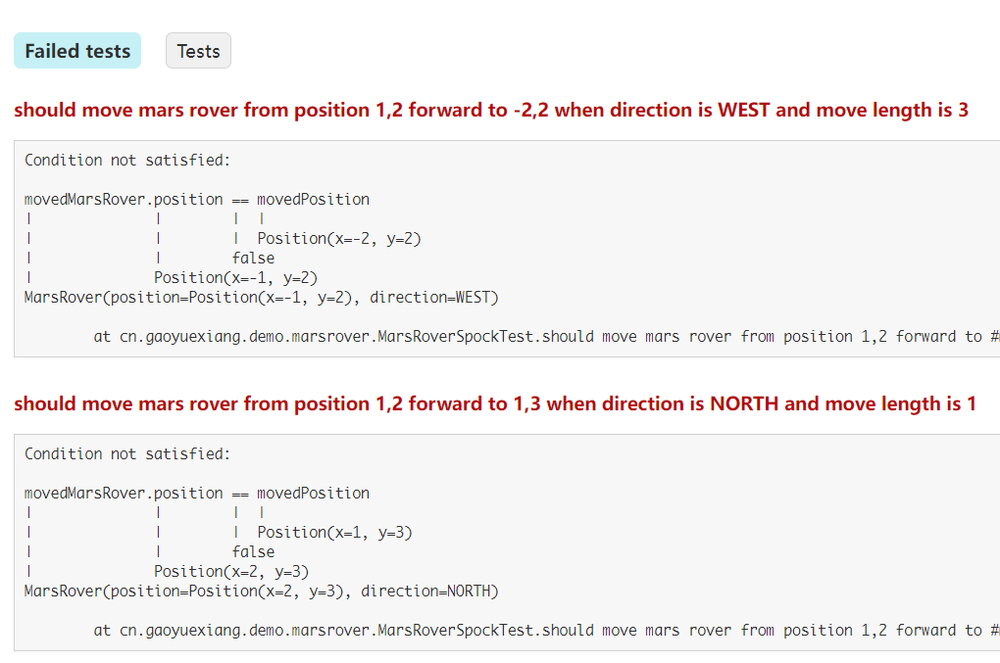

在我们日常的 TDD 开发中，永远绕不过去的就是要编写测试。而对于一个 Java 程序员，JUnit 似乎是一个不二的选择。它的确是一个十分优秀的工具，在大多数情况下都能够帮助我们完成测试的工作。

但是在开发过程中，我发现 JUnit 并不总是那么好用。它在一些情况下需要耗费挺多精力才能编写出让人满意的测试。

## JUnit 不擅长的事情

一个让人满意的测试，应该能够清晰的体现被测试的目标、测试的目的以及测试的输入输出，并且应遵循 `DRY` 原则，尽可能的减少测试中的重复内容。

JUnit 可以通过设计测试方法名和组织方法内的代码的方式清晰的表达意图，也可以通过参数化测试来减少相同测试目的的测试代码重复。但是它在这些地方都做的不够好。

### 清晰表达测试的目的

在使用 JUnit 时，清晰的表达测试意图并不是总能做到的事情。这主要体现在两个方面。

#### 如何命名测试方法

第一个体现就是在使用 Java 编写测试时，采用什么样的命名风格来命名测试。是为了代码风格的统一而选择驼峰？还是为了更高的可读性选择下划线？这个问题在不同的项目中有不同的实践，看起来是没有一个统一的认识。

而这个问题的根源是 JUnit 的测试名称是 Java 的方法名，而 Java 的方法名又不能在其中插入空格。所以除了下面要介绍的两种测试工具外，采用 [Kotlin](https://kotlinlang.org/docs/coding-conventions.html#names-for-test-methods) 来编写 JUnit 也是一种方式。

#### 如何组织方法内的代码

第二个体现就是 JUnit 对测试方法内部如何编写没有强制的规定。这就意味着我可以在测试里面任意地组织代码，比如在一个测试方法里面对一个方法调用多次并验证每一次的结果，或者把调用测试目录的逻辑和准备数据的逻辑以及验证逻辑混合到一起。
总之这样的结果就是测试方法内的代码组织方式千奇百怪，每当阅读别人编写的测试的时候，总是要花上好几分钟才能知道这些代码到底在干什么。

对于这个问题，我个人会选择使用注释来标注一下 `given` 、 `when` 、 `then`，并且给 IDEA 设置了 live template 方便插入它们。

### 又不是不能用的参数化测试

如果说不能清晰地表达测试意图这个问题还有一些 workaround 可以绕过去的话，JUnit 那仅仅是能用的参数化测试功能就没有什么好办法可以绕过去了。

JUnit 提供了各种 `Source` 注解来为参数化测试提供数据，但是这个功能实在是太弱了，很难让人满意。

难以让人满意的第一个原因是，各种 `Source`  注解基本上只能支持 7 种基本类型再加上 `String`， `Enum` 和 `Class` 类型。如果想要使用其他类型的实例作为参数的话，就必须要使用 `MethodSource` 或者 `ArgumentsSource` 注解。

这就导致了第二个原因：这两个注解需要单独写一个**静态**或一个 `ArgumentProvider` 的实现，这就导致很难把测试参数写到测试代码旁边。并且 `Arguments.of()` 方法并不利于阅读测试参数。

> `MethodSource` 要求使用**静态**方法，这在使用 Kotlin 编写 JUnit 时需要把这些方法写到 `companion object` 里面，并且加上 `@JvmStatic` 注解。因为 Kotlin 里面没有 `static` 关键字。

这两点导致测试的可读性下降。而按照“测试即文档”的原则，我们应该尽力去保证测试的可读性。

第三个原因则是来自 `ParameterizedTest` 注解。它的 `name` 字段可以使用参数的索引值来把参数填入模板中，生成更加可读的测试名称。
但是它的功能也仅限于此了。因为这个模板只能使用索引值，不能使用索引后再调用里面的方法或者字段。所以如果我们的参数是一个复杂对象，那么一定要重写 `toString` 方法才能得到满意的输出。但是这又违背了编写测试的原则之一——不能为了测试而添加实现代码。
如果我们一定要得到一个更加表意的测试名称，那么添加一个专用的测试参数也能做到。但是这又会导致 IDE 或者构建工具的警告，因为它们认为这个参数没有被使用。

---

总之，尽管 JUnit 可以解决绝大多数问题，但是在这么几个小地方却做的不是那么完美。

那么有没有什么工具可以作为 JUnit 的替代呢？当然是有的。下面我将按照我接触的顺序来介绍两种种测试框架。可以在 GitHub 上找到下面例子的[完整代码](https://github.com/kbyyd24/java-test-framework-demo)。

## 使用 Spock 作为测试框架

[Spock](https://spockframework.org/)是一个用 `Groovy` 编写的测试框架，按照 `given/when/then` 的结构定义 dsl，能够让测试更加的语义化。它的一大特点是 [Data Driven Test](https://spockframework.org/spock/docs/2.0/all_in_one.html#data-driven-testing)，可以方便的编写参数化测试。

我曾在两个项目上尝试过使用 `Spock` 作为测试框架，几乎没有遇到过无法解决的问题。

### 如何使用 Spock

由于 `Spock` 是使用 `Groovy` 来编写测试的，所以我们要使用它时，除了要引用它本身，还需要添加对 `Groovy` 的支持。以 `gradle` 为例：

```groovy
plugins {
  id 'groovy'
}

dependencies {
  testImplementation 'org.spockframework:spock-core:2.0-groovy-3.0'
  testImplementation 'org.spockframework:spock-spring:2.0-groovy-3.0'
}
```

第二个依赖提供了一些对 Spring 的支持，比如可以使用 `@SpringBean` 注解来让被 mock 的对象注入到测试的容器中。

我们先看一个最简单的例子：

```groovy
class MarsRoverSpockTest extends Specification { // 1
  def "should return mars rover position and direction when mars rover report"() { //2
    given:  // 3.1
    def marsRover = MarsRoverFixture.buildMarsRover(  
      position: new Position(1, 2),  
      direction: Direction.EAST,  
    )  
  
    when:  // 3.2
    def marsRoverInfo = marsRover.report()  
  
    then:  // 3.3
    marsRoverInfo.position == new Position(1, 2)  
    marsRoverInfo.direction == Direction.EAST  
 }
}
```

1. 每一个测试都需要继承抽象类 `Specification`
2. 可以使用字符串来命名测试
3. `Spock` 定义了一些 block，这里的 `given` 、 `when` 、 `then` 都是 block。
	1. `given` block 负责测试的 setup 工作
	2. `when` block 可以是任意代码，不过最好是对测试目标的调用。它总是和 `then` 一起出现
	3. `then` block 用来断言。这里不需要任何的 assertion，只需要编写返回值是 boolean 的表达式即可

`Spock` 有非常友好的测试报告输出。如果我们把上面的断言特意改错，就能得到这样的测试输出：

```text
Condition not satisfied:

movedMarsRover.position == movedPosition
|              |        |  |
|              |        |  Position(x=-2, y=2)
|              |        false
|              Position(x=-1, y=2)
MarsRover(position=Position(x=-1, y=2), direction=WEST)
```

在这个输出里面，我们可以清晰的看出表达式两端的值是什么，非常便于 debug。

接下来再看一个和 `Spring` 集成的简单例子：

```groovy
@SpringBootTest  
class MarsRoverServiceSpockTest extends Specification {  
  @SpringBean  
  MarsRoverRepository repository = Mock()  // 1
  
  @Autowired  
  MarsRoverService service 
  
  def "should move mars rover forward success"() {  
    given:  
    def id = "id"  
    def marsRover = MarsRoverFixture.buildMarsRover(  
      position: new Position(1, 2),  
      direction: Direction.NORTH,  
    )  
    repository.findById(id) >> marsRover  // 2
  
    when:  
    service.forward(id, 3)  
  
    then:  
    1 * repository.save({ it.position == new Position(1, 5) })  // 3
  }  
}
```

1. 使用 `SpringBean` 注解注入到测试的上下文中； `Mock` 是 `Spock` 提供的 mock 方法
2. 为 mock 对象的方法调用设置返回值
3. 验证 mock 对象的方法被调用的次数和参数

### 特点

##### 语义化的结构

在前面的例子中，我们看到了 block 的概念。它可以帮助我们更好的组织代码结构，写出更加便于阅读的代码。其实在每一个 block 声明之后，我们还可以在添加一个字符串，达到注释的作用。比如：

```groovy
given: "a mars rover at position 1,2 and direction is north"
```

除了上面的例子里看到的，`Spock` 还提供了 `cleanup` 、 `expect` 、 `where` 这三个 block。详细信息可以看看它的[文档](https://spockframework.org/spock/docs/2.0/all_in_one.html#_blocks)

##### 简洁的断言

在上面的例子中，我们看到 `Spock` 的断言十分简洁，不需要像使用 `assertj` 一样写很长的 `assertThat(xxx).isEqualTo(yyy)`，只需要一个返回 boolean 的表达式就可以了。
甚至可以把多行断言提取到一个方法中，返回他们与运算的结果。

##### 使用 data table 构造参数化测试

对于参数化测试，我们再来看一个例子。

```groovy
def "should move mars rover from position 1,2 forward to #movedPosition.x,#movedPosition.y when direction is #direction and move length is #length"() { 
  given:  
  def marsRover = MarsRoverFixture.buildMarsRover(  
    position: new Position(1, 2),  
    direction: direction,  
  )  
  
  when:  
  def movedMarsRover = marsRover.forward(length)  
  
  then:  
  movedMarsRover.position == movedPosition  
  movedMarsRover.direction == direction  
  
  where: 
  direction       | length || movedPosition  
  Direction.EAST  | 2      || new Position(3, 2)  
  Direction.WEST  | 3      || new Position(-2, 2)  
  Direction.SOUTH | -1     || new Position(1, 3)  
  Direction.NORTH | 1      || new Position(1, 3)  
}
```

我们可以看到代码的最后一段是一个 `where` block，这是 `Spock` 中用来定义数据测试的数据的地方。例子中的写法被称作 data table。尽管 `Spock` 还支持一些其他的写法，但是我个人认为 data table 是一个更加可读的写法，所以这也是我最常使用的写法。并且这个写法不需要手动调整格式，IDEA 支持自动 format，堪称完美。

我们还可以留意一下方法名。方法名中有几个以 `#` 开头的字符串，它们其实是在引用 data table 中定义的变量。这种通过变量名引用的方式可读性远远大于 JUnit 的索引值的方式。并且我们可以看到 `#movedPosition.x` 这样的表达式，它们可以直接使用这些对象中的字段值来生成方法名，不需要依赖于对象的 `toString` 方法。

它的测试输出也非常便于定位失败的测试数据。



##### 使用 Groovy 编写测试

使用 `Groovy` 来编写测试，可以说既是优点，也是缺点。

优点是在于 `Groovy` 是动态语言，我们可以利用这一特性在测试中少写一些啰嗦的代码。并且在前面的例子中，断言里面获取的 `marsRover.position` 字段本身是 private 字段，测试仍然可以正常执行。这些都是由 `Groovy` 带来的灵活性。

缺点在于这是一个相对小众的语言。如果不是因为 Gradle，或许不会有多少人熟悉它的语法。这也会导致人们在选择它时会变得更加谨慎。

##### 与 IDE 的完美集成

我一直使用的 IDEA 是能够完美适配它的。除了前面提到的 format data table ，最主要的是 IDEA 能像执行 JUnit 一样执行它，并且不需要任何的配置。

### 缺点

我在第一个项目里面使用 `Spock` 时，几乎没有发现它有什么缺点，以至于在后来的项目中总是在问 TL 能不能把它加到项目里来 🤪

但是后来在一个 Kotlin 项目中尝试使用它时，却遇到一些问题。

##### 与 Kotlin 的集成问题

###### 无法识别 Kotlin 的语法糖

`Groovy` 不能直接识别到 `Kotlin` 代码中的各种语法糖，这就让测试写起来有那么一点点不舒服。

比如命名参数。其实 `Groovy` 也支持命名参数，但是语法和 `Kotlin` 不同。这就显得有一点尴尬。不过这个问题可以通过为测试编写一些 fixutre 之类的代码来帮助处理这里问题。比如下面这个 `Kotlin` 类型

```kotlin
data class MarsRover(  
  private val position: Position,  
  private val direction: Direction,  
)
```

我们可以为它编写一个 fixture，就能在测试里面也使用命名参数了

```groovy
class MarsRoverFixture {  
  @NamedVariant  
  static MarsRover buildMarsRover(position, direction) {  
    new MarsRover(position, direction)  
  }   
}
```

其他的一些语法问题也基本都能绕过，本质思路就是把要测试的代码想象成编译后的 `Java`，这样就能找到绕过的办法。

###### 没有对 final class 的 mock 支持

这是一个基本绕不过去的问题。`Kotlin` 里面的类型默认都是 `final`，不能再被继承。但是 `Spock` 的 mock 却需要为要 mock 的对象的类型创建一个子类。这就导致我们不能去 mock 那些类型。其实这个问题不是 `Spock` 特有的，`Mockito` 也有这个问题。只不过在使用 JUnit 时我们会选择用 `MockK` 作为 `Kotlin` 项目的 mock 工具，而不是 `Mockito`。

解决这个问题的策略有好几个：

1. 尽可能不去 mock。这要求我们设计出更容易测试的代码，这样就可以避免在测试中使用 mock。
2. 使用 Spring 的 Kotlin 插件 `org.jetbrains.kotlin.plugin.spring[](org.jetbrains.kotlin.plugin.spring)` 。它可以把 `Spring` 的 component 类都修改成 open，这样就能 mock 了

在写这篇文章的时候，发现一个很久没有更新的仓库 [kotlin-test-runner](https://github.com/dpreussler/kotlin-testrunner)，也许可以借鉴一下这里的思路来解决这个问题。

###### 与 JUnit 的兼容问题

对于上一个问题，我们当时还有一个 workaround，那就是使用 `JUnit5` + `MockK` 来编写那些需要 mock 的测试。但是那个时候的 `Kotlin` 版本还比较低，没有遇到和 JUnit 的兼容问题。

兼容问题是 JUnit 在编写 Spring 集成测试的时候，如果有 mock bean 的需求，需要使用 [springmock](https://github.com/Ninja-Squad/springmockk) 里面的 `@MockkBean` 注解。但是从 kotlin 1.5.30 开始，这个库就不能和 Spock 编写的 Spring 集成测试兼容，会出现 NPE 问题。这个问题在使用 `Kotlin` 对 `Specification` 子类进行反射时会出现。如果对这个问题感兴趣，可以看看这个 [issue](https://github.com/Ninja-Squad/springmockk/issues/67) 。

##### Groovy 语言的学习成本

就像前面提到过的，使用 `Groovy` 还是有一些学习成本的。如果团队里没有熟悉它的人，可能会走一点弯路。

## 使用 Kotest 作为测试框架

`Kotest` 是在无意中发现的测试框架，还没有在实际的项目中实践过。所以这里只能分享一下如何使用，没有什么经验分享。

### 如何使用 Kotest

`Kotest` 的测试目标是 `Kotlin` 代码，所以它除了支持 `Java` 以外，还支持用 `Kotlin` 编译的 JS。不过这里，我们就只试试 JVM 平台就好。

```groovy
dependencies{
  testImplementation 'io.kotest:kotest-runner-junit5:5.0.1'
  testImplementation 'io.kotest:kotest-assertions-core:5.0.1'
}

test {
  useJUnitPlatform()
}
```

这样我们就能使用 `Kotest` 最基础的功能了。接着我们来看一个例子。

```kotlin
class MarsRoverKotestTest : BehaviorSpec({  
  given("a mars rover") {  
    val marsRover = MarsRover(  
      position = Position(1, 2),  
      direction = Direction.EAST,  
    )  
    `when`("it report information") {  
      val (position, direction) = marsRover.report()  
      then("get it's position and direction") {  
        position shouldBe Position(1, 2)  
        direction shouldBe Direction.EAST  
      }  
    }  
  }  
})
```

这是一种 BDD 风格的测试。`Kotest` 使用 `BehaviorSpec` 类封装起来。

在 `then` 中，我们没有看到常见的 `assertThat()` 语句，取而代之的是 `Kotest` 的 assertion 库提供的方法。

接着我们再看一个 Spring 集成测试的例子，这需要多引入一个依赖 `io.kotest.extensions:kotest-extensions-spring`

```kotlin
@SpringBootTest  
class MarsRoverServiceKotestTest(  
  service: MarsRoverService,  
) : FunSpec() {  
  @MockkBean lateinit var repository: MarsRoverRepository  
  override fun extensions() = listOf(SpringExtension)
  
  init {  
    test("should move mars rover success") {  
      // given  
      val id = "id"  
      val marsRover = MarsRover(  
        position = Position(1, 2),  
        direction = Direction.NORTH,  
      )  
      every { repository.findById(id) } returns marsRover  
      val marsRoverSlot = slot<MarsRover>()  
      every { repository.save(capture(marsRoverSlot)) } just Runs  
  
      // when  
      service.forward(id, 3)  
  
      // then  
      val movedMarsRover = marsRoverSlot.captured  
      movedMarsRover.report().position shouldBe Position(1, 5)  
      movedMarsRover.report().direction shouldBe Direction.NORTH  
 }  
  }  
}
```

在这个例子中，除了 `override fun extensions()` 那一行以外，其他部分的代码和 JUnit 的集成测试几乎没有区别。而这一行就好像 JUnit 中的 `@ExtendWith(SpringExtension)` 一样。我们甚至可以抽出所有的集成测试代码到单独的 `sourceSet` 中对 extensions 进行全局配置。[Spring | Kotest](https://kotest.io/docs/extensions/spring.html) 

### 特点

##### 丰富的测试风格支持

除了上面的例子，我们还有很多的测试风格可以选择，这在它的文档中有介绍：[Testing Styles | Kotest](https://kotest.io/docs/framework/testing-styles.html)

##### 简洁的断言

在上面的例子里面我们看到，`Kotest` 提供了自己的断言库，不需要再写冗长的 `assertThat()` 之类的语句

##### 使用 Kotlin 编写，能与 Kotlin 项目完美结合

使用 `Kotlin` 来编写测试，可以使用到 `Kotlin` 里面的各种语法糖。这样就不用像 `Spock` 一样在语法切换中挣扎。

##### 支持 MockK

同样的，因为 `Kotest` 的测试使用 `Kotlin` 编写，自然是支持 `MockK` 的。这样就能利用 `MockK` 的特性，支持对 final class 的 mock。

##### 与 JUnit 兼容

因为 `Kotest` 是基于 JUnit 平台的，所以是能和 JUnit 兼容的，不会出现上面的 `Spock` 那样的问题。

##### 对 data driven test 的支持

`Kotest` 提供了扩展来支持 data driven test。当然，不使用这个扩展也可以进行，比如用 list 构造好数据之后 foreach 创建测试。不过这里的例子我们还是使用这个扩展来演示。（需要添加依赖 `io.kotest:kotest-framework-datatest` ）

```kotlin
class MarsRoverKotestTest : FunSpec({  
  context("data test") {  
    withData(  
      nameFn = { (direction, length, position) ->  
        "should move mars rover from 1,2 to ${position.x},${position.y} when direction is $direction and move length is $length"  
 },  
      Triple(Direction.EAST, 2, Position(3, 2)),  
      Triple(Direction.WEST, 3, Position(-2, 2)),  
      Triple(Direction.SOUTH, -1, Position(1, 3)),  
      Triple(Direction.NORTH, 1, Position(1, 3)),  
    ) { (direction, length, movedPosition) ->  
      val marsRover = MarsRover(  
        position = Position(1, 2),  
        direction = direction,  
      )  
      val movedMarsRover = marsRover.forward(length)  
      movedMarsRover.report().position shouldBe movedPosition  
      movedMarsRover.report().direction shouldBe direction  
    }  
  }  
})
```

虽然这个 data driven test 相对于 `Spock` 的 data table 来讲没有那么直观，但是对比 JUnit 的话，能够方便的自定义测试方法名，并且测试数据与测试代码放在一起，已经算是一个巨大的进步了。

### 缺点

因为没有在实际的项目中实践过，所以目前没有发现很多的缺点。

##### 与 IDEA 和 Gradle 的集成不够完美

这个问题的表现是在 IDEA 里面无法执行单个测试方法。但是细究后发现，实际上是和 gradle 的集成不够好。

默认情况下，IDEA 会使用 gradle 来执行测试。执行单个测试的命令是 `gradle test --tests "xxx.Class.yyyMethod"`。对于 JUnit，这里的 class 和 method 是很直观的类名和方法名。但是 `Kotest` 的写法却不是编写类里面的方法，而是调用方法生成测试。所以 gradle 的这个命令就没有办法生效，也就没有办法只执行一个测试方法了。

在把 IDEA 的配置更新成使用 IDEA 来运行测试后，在 mac 上能够正常执行一个测试方法。但是在 Windows + WSL 的环境上却会出错。（看起来像是 IDEA 的问题，因为它尝试把 WSL 里面的 java 当作 Windows 的程序执行）

## 不要使用 Spek

前面介绍了两种值得一试的测试框架，这里再介绍一种不建议使用的框架。

当初想要尝试这个框架，是因为看到有网友说这是 `Kotlin` 版本的 `Spock`  🙃。但是实践下来并没有发现它有和 `Spock` 类似的功能，并且还出现了这些痛点：

1. 与其他测试框架混合使用的问题
	当与其他测试框架混合使用时，`Spek` 测试总是会先执行。哪怕我们在 IDEA 里面只想执行一个 JUnit 的单元测试，`Spek` 也会先把自己的所有测试跑完，然后才会执行到我们想要执行的测试。这就意味着在 `Speck`  测试编写了很多之后，执行其他测试就会等待很久。
2. 不能编写 Spring 集成测试
3. 我在写 demo 的时候发现，它的 IDEA 插件在 Windows 上面无法工作

如果这些痛点你都能忍，那我也不建议使用这个框架，毕竟上面已经有更好的选择了。

---

## 总结

现在我们有了两个 JUnit 以外的测试框架选择。当然它们也不是完美的，JUnit 仍然是那个最稳定、风险最低的那一个。但如果你想尝试一下这两个框架的话，可以考虑一下这些方面：

1. 生产代码的编程语言
	1. 如果是 Kotlin，那么可以考虑 `Kotest`，不要考虑 `Spock`
	2. 如果是 Java，那么这两个都值得考虑
2. 语言熟悉程度
	1. Kotlin 明显是比 Groovy 更加流行，这个角度考虑的话 `Kotest` 是更优的选择
3. 测试框架的流行程度（这方面我不知道有什么评价标准，只是作为参考）
	1. 两个框架在 GitHub 上的 star 数量半斤八两，一个 3.1k，一个 3.2k（JUnit 也才 4.9k）
	2. 在 MVNRepository 上，[Spock](https://mvnrepository.com/search?q=spockframework) 的 usage 明显高于 [Kotest](https://mvnrepository.com/search?q=kotest)
4. IDEA 的集成
	1. `Spock` 在这方面完全没有问题
	2. `Kotest` 需要安装插件，并且在 Windows + WSL 的模式下不能运行单个测试
5. Gradle 集成
	1. `Spock` 完美集成
	2. `Kotest` 不能执行单个测试


