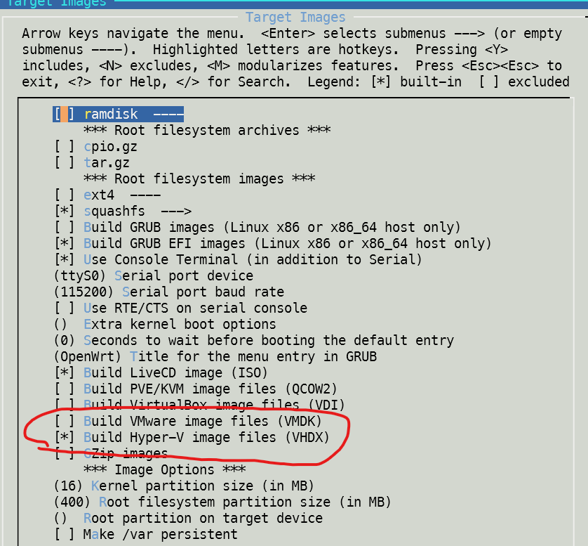
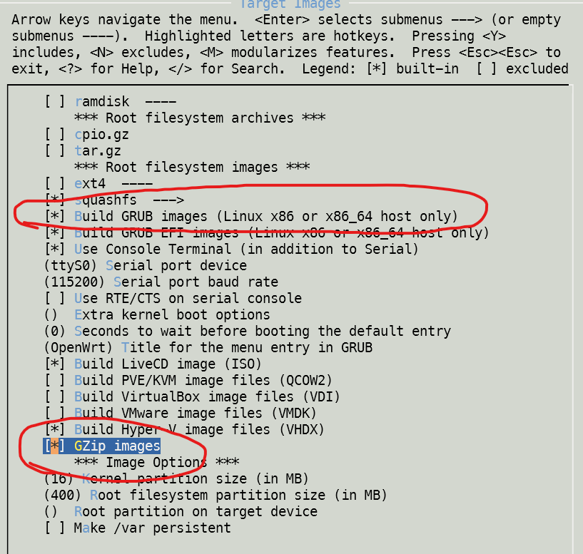
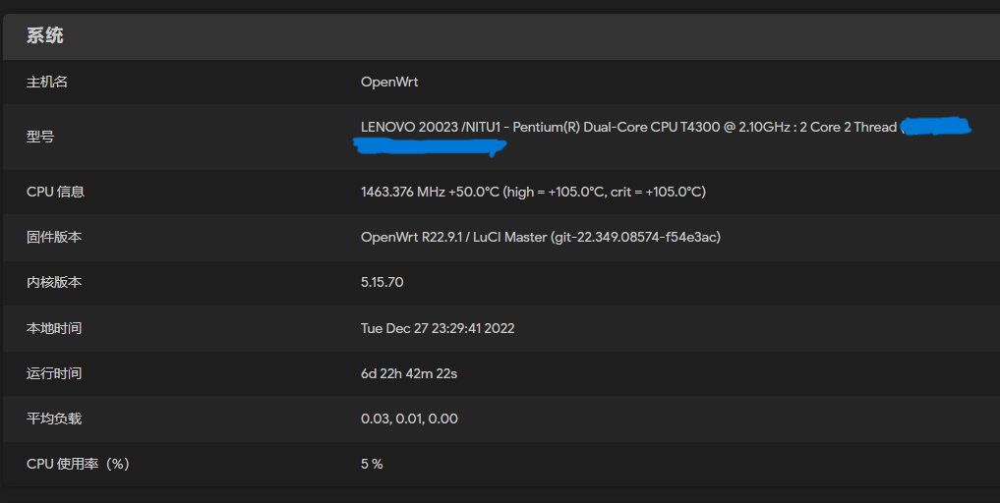

之前在了解到软路由之后，一直想给自己的网络也搞一个软路由。这样就不需要在每个设备上进行配置，也可以让一些没有软件支持的设备（比如 xbox）也能体验到科学的魅力。

在网上的绝大多数教程中，往往都是购买一个专用的软路由设备，然后给它刷入 [lede](https://github.com/coolsnowwolf/lede) 系统。但是这些设备并不便宜，就算是低端设备也需要 4-500 元才能拿下。

这些教程中，网络拓扑图也是一模一样👇，都是在网络链路中加入一个软路由设备作为节点。

这也就锁死了我的想象，因为一定需要一个双网卡的设备来作为这个新的节点，所以一定需要一个新的设备。

但是我还是在一些教程中发现了树莓派的身影。因为树莓派默认只带有一个网口，应该是不能作为软路由设备的。那么这些方案又是如何成功的呢？
终于，我发现了另一种解决方案 —— 旁路由

## 旁路由

旁路由的拓扑图👇并不一样，软路由设备并不是其他终端设备接入互联网中的必经之路。对于主路由来说，它就像一个普通的终端设备一样。

那么旁路由是怎么工作的呢？🤔

要搞清楚这个问题，就需要了解我们的设备都是怎么访问到网络的。
当我们的一个设备接入一个局域网，往往默认会使用 DHCP 协议，也就是自动分配 IP 的方式。路由器会查询已经使用的 IP 地址，然后给新加入的设备分配一个没有被使用的 IP 地址。但这不是全部内容。路由器还会自动帮我们配置好子网掩码、网关、DNS。掩码的作用是让我们的设备知道当前网络的 IP 段；网关的作用是让我们的设备知道要把网络数据包发送到哪里；DNS 的作用则是用来获取域名对应的 IP 地址。他们的值往往是由路由器来决定的。

旁路由就是，我们要修改我们设备的配置，手动的把网关和 DNS 修改为软路由的地址。这样我们的数据包就会被转发到软路由，从而能够利用软路由来管理我们的网络。
当然，软路由则应该保持网关和 DNS 都指向主路由，这样软路由转发出去的数据才能被发送到互联网中。

这样的缺点是需要主路由支持 IP 绑定。因为我们需要做很多手动修改 IP 的操作，为了避免 IP 被占用，必须把这些 IP 绑定到对应的设备。

但这样也有一个好处，那就是那些不需要软路由的设备，比如那些智能家居，不需要做任何配置，仍然可以保持之前的上网体验。

## 利用 Hyper-V 虚拟机来作为软路由

既然可以采用旁路由这种方案，那么网口就不再是我们的限制了。虚拟机就成了我的一个选项，因为手边已经没有多余的设备，而台式机的性能足够强劲，能撑得住 24 小时不关机。

### 编译 lede

关于软路由的系统，当然是选择强大的 [lede](https://github.com/coolsnowwolf/lede) 。因为尝试了别人编译的版本不是很满意，所以我还是决定来自己编译。其实操作很简单，只需要按照 readme 来做就行。

> 最好找到最新的 release 对应的 commit，而不是使用最新代码

其中的 `make menuconfig` 这一步需要我们做一些修改。在 `Target Images` 中选中 `Build Hyper-V image files` ，这样我们就可以得到能够直接作为 Hyper-V 虚拟机硬盘的文件。

接着按照 readme 的指示完成编译，就可以在 `bin/targets/x86/64/` 下面找到我们编译成功的文件了，文件名应该是 `openwrt-x86-64-generic-squashfs-combined-efi.vhdx`

#### 修改 IP 地址

另一个可以在编译前做的事情是修改 IP 地址。当然也可以在虚拟机创建完成开机后来修改。
默认的 IP 地址是 192.168.1.1，可以把它修改成你想要的 IP。

在编译前，它在 `package/base-files/files/bin/config_generate` 中，搜索默认的 IP 地址就能找到。

在开机后，可以通过 `vim /etc/config/network` 来修改。

### 创建虚拟机

接下来我们来创建虚拟机。因为 lede 并不需要消耗多少资源，所以我们可以只分配一个处理器。内存我当初分配了 1G，事实证明这过于慷慨，512M 肯定是够用的。

#### 配置网络适配器

这是虚拟机配置中最关键的一步，我们需要让我们的软路由虚拟机能够被主路由找到，这样主路由才能转发那些要发送到软路由的数据包。
所以我们要在 `虚拟交换机管理器` 中新建一个交换机，其中的连接类型选择 `外部网络`，然后选择一个连接到了主路由器的网卡，选中 `允许管理操作系统共享此网络适配器`。

然后在创建虚拟机的时候选择这个网络适配器。

这样，被选中的网卡就可同时为虚拟机和 Windows 提供网络服务。当然，如果你有多个网卡，那也可以不选最后那个选项，Windows 可以使用其他网卡来连接主路由器。

#### 选择硬盘

在这一步我们不需要创建新的硬盘，选择 `使用现有虚拟硬盘`，然后找到我们编译出来的 vhdx 文件就可以了。

#### 配置开机启动

虽然物理机性能可以保证 24 小时开机，但它安装的是 Windows 啊，怎么可能不自己悄咪咪地重启呢。

所以要让我们的虚拟机开启自动启动，这样才像一个独立的路由器嘛。

现在要在 Hyper-V 里面做到这一点非常简单，Hyper-V 已经提供了图形化的界面来支持这个配置。只需要在虚拟机设置里找到 `管理 > 自动启动操作` 选择 `自动启动` 或者 `始终自动启动` 就好了。

#### 软路由配置

创建完虚拟机之后，我们还需要经过一些配置才能让这个软路由真正发挥作用。

##### 修改密码

lede 使用的是 root 账号，我们通过 Hyper-V 连接到虚拟机的命令行，就可以通过 `passwd` 来修改密码。之后就可以利用这个账号来登录网页管理界面，也可以利用这个账号来使用 ssh 登录命令行。

##### 修改 IP

这里的 IP 涉及到三种设备的配置。

首先是前面提到的软路由自己的 IP 地址配置，我们可以给它配置任意没有被分配的 IP 地址。然后按照你的主路由来配置它的网关、掩码和 DNS。

接下来是配置我们需要使用软路由服务的终端设备，把自动获取 IP 修改成手动配置，把其中的网关和 DNS 都修改为软路由的地址，其他内容不变。

最后是主路由，因为 IP 是由它来分配的，而我们上面做了很多手动的配置。为了保证我们手动配置的 IP 能和设备绑定，避免 IP 被占用的情况出现，我们需要在主路由上绑定这些设备的 IP 地址。

### 小结

我按这个方案完成了我的第一版软路由改造。没有花一分钱就搞定了软路由。除了必须保证这台电脑一直运行之外，没有什么不便的。

## 利用旧电脑来做软路由

上面那一版方案我使用了一年半的时间，直到有一天回家发现当年亲戚家淘汰的旧电脑没人用，这可不是浪费了吗？于是我就把它薅了过来，尝试用这个旧电脑来做软路由，解放我的台式机。

### 旧电脑有多旧？

这台电脑是联想的 G550 20023，产于 2009 年，马上就要进入第 14 个年头了。它陪伴我大学的第一年，在一次维修后因为少装了一个垫圈而退役，后来在另一个维修店里被救活。

它的 CPU 是奔腾的 T4300，双核两线程；内存被我升级到了 4G；硬盘容量是 500G，转速是 5400rpm。
而其他信息在 PE 盘的 cpu-z 中查看不到，官网也无法查看这台电脑的详细配置。

可以说这算是一台古董了。那它能被用来做软路由吗？让我们来试试看。

### 编译 lede

因为是一台老古董，所以我们需要对编译进行一些配置。

#### 选择 target

因为是一个老古董，并不支持 uefi 启动，所以我们需要在 `Target images`  里面选择 `Build GRUB images`。

另外，为了能把系统文件复制到硬盘中还需要选中 `GZip images`

#### 选择网卡设备

老古董带来的另一个问题则是我不知道网卡的型号。所以当我第一次把系统安装到这个老古董之后发现设备无法上网，`ifstatus lan` 的输出里看到 `NO DEVICE` 的字样。

所以我们需要在 `Kernel modules > Network Devices` 中选中所有的设备，赌一赌其中有某一个驱动能够识别到这台机器地网卡。

#### 编译结果

其他的配置就可以自由选择了，最后我们需要的就是 `bin/targets/x86/64/` 里面的 `openwrt-x86-64-generic-squashfs-combined.img`。

### 安装到硬盘中

如果不是不想浪费一个 U 盘的话，其实不需要这一步。不过如果能解放一个 U 盘，为什么不呢？而且做法也很简单，就是制作一个 PE 盘，然后把我们编译好的文件放到 U 盘里面。最后再下载一个 [physdiskwrite](https://m0n0.ch/wall/physdiskwrite.php) ，也放到 U 盘里。

然后在老古董上面启动 PE 盘，在 cmd 中输入 `physdiskwrite -u path/to/openwrt-x86-64-generic-squashfs-combined.img`。等写入成功，就可以重启了，之后我们就会得到一个新的软路由。

而且因为软路由系统不是为这些笔记本设计的，所以盖上盖子它也能正常运行，不用担心像 Windows 或者 Mac 一样休眠。所以我可以把这台电脑放到角落里面，就好像它不存在一样。

## 总结

这一年半里用两种设备尝试了同一套软路由方案。在这个过程中，我没有花一分钱，可以说是零成本的软路由方案了。

如果你也像尝试软路由，你恰好也有一个性能过剩的电脑，或者一个还能拯救一下的老古董，不妨试试我的这个两种落地方法。其中还有很多细节我没有写，可以多查一查，都很容易找到答案。
