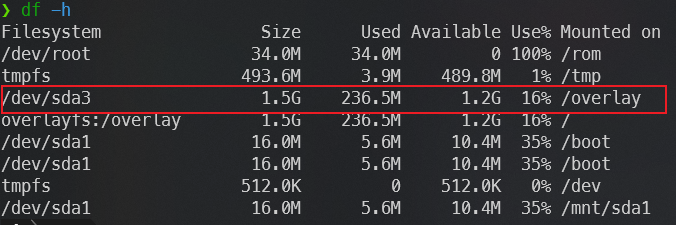
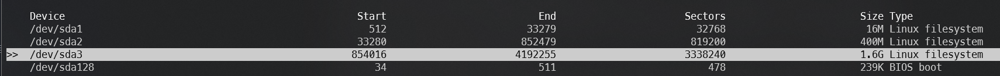
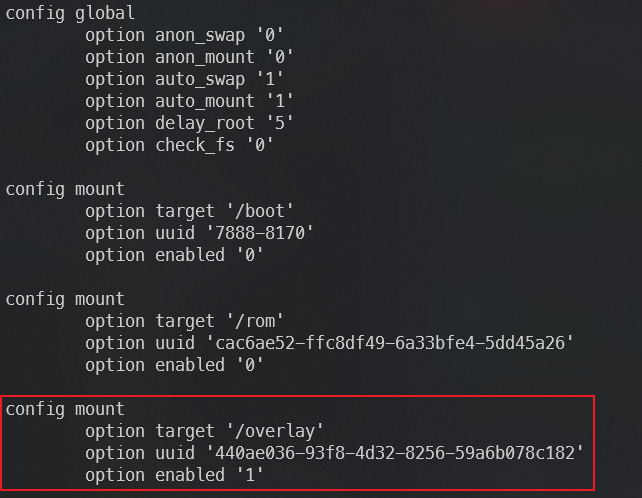

# Openwrt 磁盘扩容踩坑记


前几天我准备给 openwrt 里的一个软件升级一下，下载的过程中却遇到磁盘空间不足的问题，于是搜索了一下别人写的文章，照着步骤进行扩容，却始终不成功。这里便记录一下踩到的坑和了解到的东西。

下面的内容适用于 overlay 文件系统，分为故事版和太长不读版。如果对踩坑过程不感兴趣，可以直接跳到太长不读版。

一些具体操作，比如 `cfdisk` 命令怎么用，我没有记录，可以参考[这篇文章](https://www.techkoala.net/openwrt_resize/)的内容（谁让我们的博客主题是近亲呢 :dog:）。

## 踩坑故事

我的 openwrt 是编译的 [lede](https://github.com/coolsnowwolf/lede) 固件，在编译前就指定好要编译成 Hyper-v 的虚拟硬盘。编译完成后我从来没有关注过硬盘大小的问题，直接挂载到 Hyper-v 里面就可以了。后来我在这个 openwrt 里面又装了 oh my zsh 等工具，做了一些定制化。

当我遇到磁盘容量不足的问题时，直接用 Hyper-v 的工具扩容了一个新的硬盘出来。它仍然有原来硬盘里的数据，多出来的空间还没有被分配。这个时候打开 Openwrt，执行 `df -h` 就会看到磁盘的大小并没有任何变化。(已经改完了，找不到 100% 占用的图了，想象一下 :dog:)



图中 `/overlay` 原始的挂载设备是 `/dev/loop0`。

于是，按照那些博客的方法，我们执行 `cfdisk` 命令对空闲的空间进行分配，得到一个可挂载的设备。在我这里是 `/dev/sda3`。



接下来就是要挂载它。有的博客说可以直接挂载到根目录，有的说可以挂载到 `/overlay` 目录。我想着一步到位，不用将来再区分哪些目录属于那个磁盘，就先尝试了挂载到根目录，挂载完成之后就是重启机器。

神奇的事情就发生了。重启后，我通过 ssh 登录 openwrt，发现公钥发生了变化。删除掉原来保存的公钥后，免密登录也没有生效，需要重新输入密码。幸亏我的密码是固件编译前就设置好了的，否则还要去想默认密码。登录之后，也看不到 oh my zsh 的 UI，而是 lede 固件最初的模样。然后 `df -h` 一看，磁盘占用还是 100%。

接着我又尝试了一下挂载到 `/overlay` 目录。但是重启后尝试 ssh 登录，发现公钥同样发生了变化，登录之后的挂载磁盘也没有任何变化，仍然是 100% 的占用。

这是为什么呢？我一直搞不懂这个问题，直到我在一篇博客的参考连接里，找到了一个b站的视频，[提到了一嘴文件系统](https://www.bilibili.com/video/BV1WK411Z79q?t=62.0)。up 主说*一些别的内容不会涉及，比如 overlayFS*。等等，overlay？好生眼熟！于是我在搜索关键词中加入了这个词，终于找到了原因。

### overlay 文件系统

[Overlay](https://docs.kernel.org/filesystems/overlayfs.html)，顾名思义，就是覆盖的一层。


> 网图，侵删

如果你关注一下 `df -h` 的输出内容，就会看到 `/dev/root` 这个设备被挂载到了 `/rom` 这个位置。ROM 不用我多说了吧？这里的内容就是只读的。里面有什么内容了？我们 ls 一下就能看到，包含了根目录所有的内容。实际上，这个只读的部分，是在固件编译时就确定的，不会被修改。

那我们对系统的修改都被存储在哪里呢？答案就是在 overlay 中。系统中有一个挂载点是 `/overlay`，里面有一个 `upper` 目录，其中的文件结构也和系统根目录的结构一致。我们对 `/rom` 中的任何改动，都是创建一个改动后的副本保存在 `/overlay/upper` 中的对应位置，新增的文件也是新增在这其中。当挂载到 `/overlay` 的磁盘满了之后，我们就不能再对系统做任何修改了。

我没有仔细看 overlay 的文档，不清楚 overlay 占用 100% 之后的系统应该如何应对。但仅仅从观察来看，openwrt 不会加载 `/overlay` 中的文件，每次重启也会生成新的 ssh key，所有的修改和不会被保存。但是我们仍然可以进入系统，那么就还有补救的办法。

### 如何解决

很简单，还是按照其他博客的步骤创建出新的磁盘，接下来先把新的磁盘挂载到任意的一个路径，把 `/overlay` 中的所有文件都复制过来。我们要用这个新的磁盘替换原来的 overlay 磁盘。

因为 overlay 被占满，我们修改磁盘挂载信息也不能被修改成功，所以我们要删掉 overlay 中一些无关紧要的东西，比如 `/root/.oh-my-zsh`，反正已经复制到新的地方了。

```sh
mount /dev/sda3 /mnt/sda3
cp -rf /overlay/* /mnt/sda3
rm /overlay/upper/root/.oh-my-zsh
```

这样我们就可以修改原来的 overlay 磁盘中的挂载信息了。可以直接在 openwrt 的 `系统 > 挂载点` 操作，也可以命令行操作：

```sh
blkid /dev/sda3 | awk -F 'UUID=' '{print $2}' | awk -F '"' '{print $2}' # 得到 `/dev/sda3` 的 UUID
vim /etc/config/fstab
```

`/etc/config/fstab` 文件中记录了挂载的信息，我们要找到 `target` 是 `/overlay` 的配置，将其中的 `uuid` 改成 blkid 得到的值，`enabled` 改成 1。



完成之后，重启，系统终于被救回来了。

但是这个时候的 `/etc/config/fstab` 中的配置又回到了之前的状态，这是因为它并不是我们刚才修改的那一个文件。在我们重启前，我们修改的文件实际上是 `/overlay/upper/etc/config/fstab`，而它在这之前已经被复制到 `/mnt/sda3/upper/etc/config/fstab` 中了。我们重启后看到的，是复制出来的新文件，而不是我们修改的那个文件。这个问题其实并不影响使用，我也不是很清楚为什么。如果想要修复它，那也很简单，重新修改一下，或者在管理页面上点一下 `系统 > 挂载点 > 生成配置` 即可。

## 总结 - 太长不读

### 准备新的分区

首先是要准备多余的磁盘空间。我的是 Hyper-v 虚拟机，直接扩容就好了。如果是物理机器，可以用磁盘上剩余的空间，也可以连接新的磁盘、插个存储卡之类的。

接下来使用 `cfdisk` 命令来分配空间。具体操作可以参考上面的文章，按照需求来分配。不过我的命令没有让我选择 primary 或者 extended，这个就按照自己的工具行为来选择就好。

然后要对这个新的磁盘进行格式化：`mkfs.ext4 /dev/sda3`。这里的 `/dev/sda3` 就是新分配的分区设备名称，需要替换成上一步创建出来的新分区。文件系统格式也可以选择其他支持的格式，不一定是 `ext4`。

### 备份磁盘

备份前，我们要先挂载新的设备，我们把它挂载到 `/mnt/sda3` 上面：`mount /dev/sda3 /mnt/sda3`。

因为我们要挂载的是 `/overlay` 目录，所以我们要把里面所有的文件都复制过来：`cp -rf /overlay/* /mnt/sda3`。

如果你遇到和我一样的情况，**`/overlay` 占用达到了 100%**，那么复制完之后在里面随便删除一些文件来释放一些空间就好。

### 替换挂载重新启动

替换磁盘挂载需要知道新磁盘的 UUID，我们可以通过 `blkid` 命令获得。

接下来要编辑 `/etc/config/fstab` 文件，找到 `target` 为 `/overlay` 的配置，把其中的 uuid 设置为上面的新磁盘的 uuid，把 `enabled` 设置为 1。这里需要修改 `/overlay/upper` 和 `/mnt/sda3/upper` 里面的两个文件，以保证重启后的配置是正确的。修改 `/overlay` 中的文件是为了下一次启动时能读取到其中的配置，修改 `/mnt/sda3` 中的文件是为了之后的配置正确性。当然，也可以在重启之后点击 Openwrt 管理页面中的 `系统 > 挂载点 > 生成配置` 来更新第二个文件。

完成之后，通过 `reboot` 重启系统，我们就完成了扩容。可以通过 `df -h` 查看新的磁盘挂载情况。

