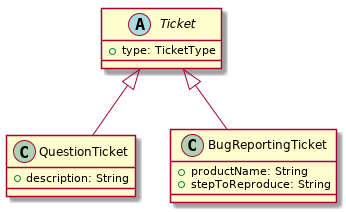

# 使用 Jackson 处理抽象类的序列化和反序列化


Json 的序列化和反序列化是我们常见的操作，很多库都提供了这样的能力帮助我们完成这样的操作。
但业务有时可能变得稍微有些复杂，需要将一个抽象类的子类实例序列化成一个 Json，也需要将一个 Json 反序列化成一个抽象类。而在反序列化的时候，就需要找到真正的子类。

`Jackson` 是 Java 中常用的一种进行 Json 序列化和反序列化的库，它能否面对这样的业务呢？

# 业务假设

假设我们有这样的类结构关系：



代码写出来长这样：

```java
package cn.gaoyuexiang.practice.jackson.inheritance;

@Data
public abstract class Ticket {
  private TicketType type;
}

@Data
@EqualsAndHashCode(callSuper=true)
public class BugReportingTicket extends Ticket {
  private String productName;
  private String stepToReproduce;
}

@Data
@EqualsAndHashCode(callSuper=true)
public class QuestionTicket extends Ticket {
  private String description;
}
```

> 可以在 [https://github.com/kbyyd24/jackson-inheritance-practice](https://github.com/kbyyd24/jackson-inheritance-practice) 看到完整代码

接下来所有的序列化和反序列化操作，都是针对类型为 `Ticket` 的变量来执行的，而不考虑真实的类型。

# 序列化

序列化不会遇到任何挑战。因为不管变量的真实类型是什么，Jackson 总是会通过所有的 `getter` 方法来找到所有的属性和值，并序列化到 Json 中。

# 反序列化

反序列化就不同了，因为程序不知道 Json 应该对应到哪一个子类，所以我们会写出这样的代码：

```java
Ticket ticket = new ObjectMapper().readValue(json, Ticket.class);
```

而抽象类又不能创建出实例，所以这一行代码就会因为这个限制而出错。

为了让这一行代码成功执行，为 `ticket` 变量找到真正的类型，我们就需要使用 `@JsonTypeInfo` 注解。

这个注解可以用到属性上，也可以用到类上，影响的只是作用范围，对效果没什么影响。本文只有使用到类上的例子。

## 指定 Json 中标识类型的值

使用这个注解时，需要使用到 use 属性，表示使用哪种信息来作为 Json 对应的实际子类的标识符。我们来看其中的几种。

### CLASS 标识

使用它时，我们的抽象类得写成这样：

```java
@JsonTypeInfo(
  use = JsonTypeInfo.Id.CLASS
)
@Data
public abstract class Ticket {
  private TicketType type;
}
```

这里的 `CLASS` 表示使用全限定类名来表示 Json 对应的类型，并且会在序列化的 Json 中插入一个 key 为 `@class` 的信息，值为类的全限定名。

比如下面的代码，就会得到这样的 Json：

```groovy
def ticket = new QuestionTicket()
ticket.type = TicketType.QUESTION
ticket.description = "some description"
def json = new ObjectMapper.writeValueAsString(ticket)
```
```json
{"@class":"cn.gaoyuexiang.practice.jackson.inheritance.QuestionTicket","type":"QUESTION","description":"some description"}
```

显然，Json 中的 `@class` 并不是 QuestionTicket 对象的字段，而是我们的注解导致这个字段的出现。
这时我们使用这个 Json 来做反序列化，就能得到一个 Ticket 对象，并且实际类型是 QuestionTicket。

### MINIMAL_CLASS 标识

这个标识同样使用类名来作为 Id，但是与 `CLASS` 不同，它不使用全限定名，而是根据子类来计算出应该是使用单纯的类名，还是包含一部分的包名。并且，最终的值前面会加上一个 `.`。

使用这个标识时，使用 `@c` 作为 key 插入到 Json 中，上面的代码会得到这样的 Json

```json 
{"@c":".QuestionTicket","type":"QUESTION","description":"some description"}
```

### NAME 标识

NAME 标识表示使用逻辑名称来标识 Json 对应的类型。默认情况下的逻辑名称是类名。

比如下面的代码会产生的 Json：

```java
@JsonTypeInfo(
  use = JsonTypeInfo.Id.NAME
)
@Data
public abstract class Ticket {
  private TicketType type;
}
```
```json
{"@type":"QuestionTicket","type":"QUESTION","description":"some description"}
```

我们可以使用 `@JsonSubTypes` 注解来指定逻辑名称和子类的映射关系：

```java
@JsonTypeInfo(
  use = JsonTypeInfo.Id.NAME
)
@JsonSubTypes({
  @JsonSubTypes.Type(value = QuestionTicket.class, name = "QUESTION"),
  @JsonSubTypes.Type(value = BugReportingTicket.class, name = "BUG_REPORTING"),
})
@Data
public abstract class Ticket {
  private TicketType type;
}
```
```json
{"@type":"QUESTION","type":"QUESTION","description":"some description"}
```

> `@JsonSubTypes.Type` 注解的 name 属性没有指定时，Jackson 会查找这个类上的 `@JsonTypeName` 注解的值用作 name ；如果也不存在，就会使用类名。

我们可以看到 `@JsonSubTypes` 注解帮助我们维护了一个逻辑上唯一的字符串和子类的映射关系，这样 Jackson 就可以根据这样的映射关系来进行序列化和反序列化了。

## 指定标识符在 Json 中的表现形式

上面的三种标识符类型，都是在原本对象序列化的 Json 中插入了一个字段来完成的。这是因为 `@JsonTypeInfo` 的 include 属性默认值是 `PROPERTY`，也就是说是在 Json 中插入一条 property。

> 如果 Json 中恰好有一条 property 的名字和要插入的 property 重复，那么就可能看到 Json 中出现两个相同 key 的字段。这可能导致一些 Json 库识别这个 Json 时出现错误，因为 Json 规范没有规定 Json 中是否可以出现两个相同的 key，具体会表现为什么行为依赖于每个库的实现。

当然，除了 `PROPERTY` 还有其他的形式可以选择。

### WRAPPER_ARRAY

这种方式会将 Json 序列化成一个数组，第一个值是 Id，第二个值才是真正的对象序列化后的 Json。

```java
@JsonTypeInfo(
  use = JsonTypeInfo.Id.NAME,
  include = JsonTypeInfo.As.WRAPPER_ARRAY
)
@JsonSubTypes({
  @JsonSubTypes.Type(value = QuestionTicket.class, name = "QUESTION"),
  @JsonSubTypes.Type(value = BugReportingTicket.class, name = "BUG_REPORTING"),
})
@Data
public abstract class Ticket {
  private TicketType type;
}
```
```json
["QUESTION",{"type":"QUESTION","description":"some description"}]
```

### WRAPPER_OBJECT

与 `WRAPPER_ARRAY` 类型，不过这种形式不是得到的数组，而是一个对象，其中的 key 就是 Id。

```java
@JsonTypeInfo(
  use = JsonTypeInfo.Id.NAME,
  include = JsonTypeInfo.As.WRAPPER_OBJECT
)
@JsonSubTypes({
  @JsonSubTypes.Type(value = QuestionTicket.class, name = "QUESTION"),
  @JsonSubTypes.Type(value = BugReportingTicket.class, name = "BUG_REPORTING"),
})
@Data
public abstract class Ticket {
  private TicketType type;
}
```
```json
{"QUESTION":{"type":"QUESTION","description":"some description"}}
```

### EXISTING_PROPERTY

顾名思义，这个形式表示将会使用原 Json 本来就有的一个字段。

使用这种形式时：

1. 序列化将不会对原本的 Json 做任何修改
2. 我们需要指定 property 属性，以表明使用原本 Json 中的哪一个字段来表示 Id

这两点表明，在使用这种形式时，原本的 Json 的这个字段自身就应该表示出对应的类型。

反序列化时，Jackson 会找到指定的 property，通过它的值和 `JsonSubTypes` 的配置来确定应该使用哪一个子类。

> property 属性在任何时候都可以使用，它可以替换掉默认的 `@class`、`@c` 和 `@type` 字段。

```java
@JsonTypeInfo(
  use = JsonTypeInfo.Id.NAME,
  include = JsonTypeInfo.As.EXISTING_PROPERTY,
  property = "type"
)
@JsonSubTypes({
  @JsonSubTypes.Type(value = QuestionTicket.class, name = "QUESTION"),
  @JsonSubTypes.Type(value = BugReportingTicket.class, name = "BUG_REPORTING"),
})
@Data
public abstract class Ticket {
  private TicketType type;
}
```
```json
{"type":"QUESTION","description":"some description"}
```

---

另外，还有一种表现形式是 `EXTERNAL_PROPERTY`，可以参考[这个问题](https://stackoverflow.com/a/20914599/6487869)

# 总结

我们了解了 Jackson 可以通过不同的标识符、以不同的形式来识别一个 Json 应该映射到哪一个类型，我们可以对如何使用做一个简单的判断。

无论是使用 `CLASS` 还是 `MINIMAL_CLASS` 类型，都会在 Json 中插入类的信息，这样既增加了 Json 和实现的耦合，也不利于重构，还导致了技术细节的泄露。

使用 `NAME` 这样的逻辑名称来标识 Json 类型看起来是比较好的做法，并且使用 Json 中本来就有的信息时，就完全去除了技术实现对 Json 的侵入，降低了耦合。

至于表现形式，则应该由 Json 本来的设计来决定。Jackson 已经给出了好几种支持，可以选择最接近设计的一种。


