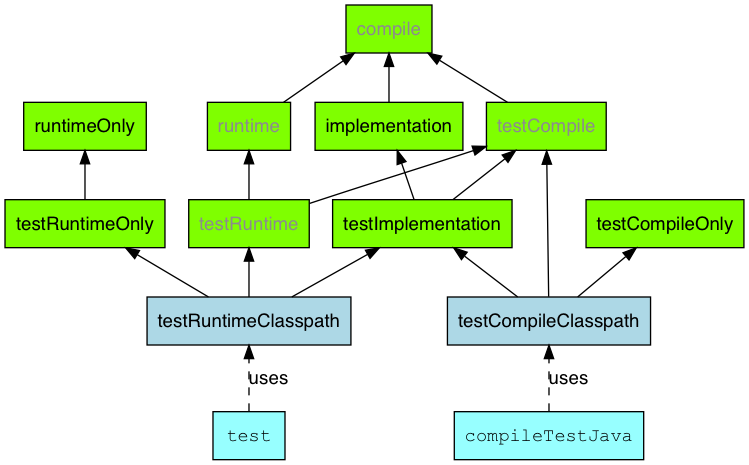

# 使用 Gradle 的 Java 插件构建 Java 项目


在[上一篇文章](../use-gradle-to-build-java-project-without-plugin/)中，我们在没有使用任何插件的情况下，练习了使用 `Gradle` 构建 `Java` 项目，最后得到一个脆弱的构建脚本和不符合约定的目录结构。

对此，`Gradle` 使用了插件来解决这些问题。

## 插件

`Gradle` 中的插件，可以给我们带来很多好处，包括：

1. 添加 `Task`
2. 添加领域对象
3. 约定优于配置的实现
4. 扩展 `Gradle` 的核心类

`Gradle` 将插件分为两类，`Script Plugin` & `Binary Plugin`。

那些写到单独的 `gradle` 文件中，并被 `build.gradle` 文件使用的脚本文件，就是 `Script Plugin`。常见的实践是将某一插件或某一方面的配置写到单独的文件中，比如 `jacoco.gradle`，然后通过下面的语法导入到 `build.gradle` 文件中：

```gradle
apply from: file("$projectDir/gradle/jacoco.gradle")
```

而常见的 `java`、`idea` 这样的 `core Plugin` 和 `org.springframework.boot` 等可以在 https://plugins.gradle.org/ 找到的插件，就是 `Binary Plugin`，它们通过 `plugins{}` 语法块引入：

```gradle
plugins {
  id 'java'
  id 'org.springframework.boot' version '2.2.4.RELEASE'
}
```

---

接下来，我们接着上一篇文章的例子，使用 `Java Plugin` 来改造我们的构建脚本。

## 改造 Hello World

`Java` 插件的文档：https://docs.gradle.org/current/userguide/java_plugin.html

### Import `Java` Plugin

如上所述，我们使用 `Java Plugin` 需要先导入它：

```gradle
plugins {
  id 'java'
}
```

因为 `Java` 插件是 `Gradle` 提供的核心插件，它是和 `Gradle` 版本绑定的，所以不需要使用 `version` 参数。

### `SourceSet`

引入 `Java` 插件后，我们先来了解一个核心概念：`SourceSet`。这是 `Java` 插件引入的概念，每一个 `SourceSet` 都包含了一组相关的资源。默认情况下，一个 `SourceSet` 对应 `src` 目录下的一个目录，目录名称就是 `SourceSet` 的名称；目录下会有一个 `java` 目录和一个 `resources` 目录。根据约定，这两个目录分别是存放 `java` 文件的目录和存放配置等资源文件的目录。

`SourceSet` 还有更多的信息可以配置，参见：https://docs.gradle.org/current/userguide/building_java_projects.html#sec:java_source_sets

`Java` 插件还默认配置好了两个 `SourceSet`，分别是 `main` & `test`。所以在使用 `Java` 插件后，无需任何配置，就可以得到约定的目录结构：

```shell
❯ tree src
src
├── main
│   ├── java
│   └── resources
└── test
    ├── java
    └── resources
```

所以，我们需要将 `HelloWorld.java` 从 `src` 目录移动到符合约定的 `src/main/java` 目录下：

```shell
❯ tree src
src
└── main
    └── java
        └── HelloWorld.java
```

### `Task`

#### `Java` 插件引入的 `Task`

接着我们来看看 `Task` 需要做哪些修改。

`Java` 插件引入了下面的这些 `Task`，并且添加了依赖关系：


其中有四个 `task` 是由 `base plugin` 添加的：`clean`, `check`, `assemble` 和 `build`。

其中，`check`, `assemble` 和 `build` 是 `lifecycle task`，本身不执行任务，只是定义了执行它们时应该执行什么样的任务：

- `check`：聚合所有进行验证操作的 `task` ，比如测试
- `assemble`：聚合所有会产生项目产出物的 `task`，比如打包
- `build`：聚合前面两个 `task`

其他的 `task` 中，很容易发现，`compileJava` 与 `compileTestJava`、`processResources` 与 `processTestResources`、`classes` 与 `testClasses` 命名类似。实际上，每一对 `task` 表达的是同样的含义，只是一个针对 `main sourceSet`，一个针对 `test sourceSet` 而已。如果你创建了一个自定义的 `SourceSet`，那 `Java` 插件会自动的添加 `compileSourceSetJava`、`processSourceSetResources` 和 `sourceSetClasses`，其中的 `sourceSet` 就是 `SourceSet.name`。

- `compileJava`：编译该 `sourceSet`下的 `java` 文件
- `processResource`：将该 `sourceSet` 中的资源文件复制到 `build` 目录中
- `classes`：准备打包和执行需要的 `class` 文件和资源文件

> 注意，执行测试是 `test` 任务，它没有因为添加 `sourceSet` 而自动添加 `sourceSetTest` 方法。因为自定义的 `SourceSet` 不一定是组件测试之类的不同类别的测试。所以，如果你添加了这样的 `SourceSet`，需要自己手动编写 `Test` 类型的测试 `task`。

#### 改进 Hello World

由上面的了解可知，`Java` 插件已经为我们添加了 `compileJava` 和 `jar` 这两个 `task`，所以我们不需要再创建这样的 `task`。但是我们还是可以对这些 `task` 进行配置。

比如，我们仍然希望控制 `jar` 产出的文件名，那我们的脚本就可以改成这样：

```gradle
// task compileJava(type: JavaCompile) {
//   source fileTree("$projectDir/src")
//   include "**/*.java"
//   destinationDir = file("${buildDir}/classes")
//   sourceCompatibility = '1.8'
//   targetCompatibility = '1.8'
//   classpath = files("${buildDir}/classes", configurations.forHelloWorld)
// }

// tasks.create('jar', Jar)

jar {
  archiveBaseName = 'base-name'
  archiveAppendix = 'appendix'
  archiveVersion = '0.0.1'
//   from compileJava.outputs
//   include "**/*.class"
  manifest {
    attributes("something": "value")
  }
//   setDestinationDir file("$buildDir/lib")
}
```

其中注释的部分可以删除，这里仅仅作为修改前后的对比。

根据 `assemble` 的定义，我们的 `fatJar` 的输出应当看作项目的产出物，所以需要让 `assemble` 依赖于 `fatJar` ：

```gradle
assemble.dependsOn fatJar
```

### `Dependency Configuration`

#### `Java` 插件引入的 `Configuration`

上一篇文章讲到，在 `Gradle` 中声明依赖，需要关联到 `configuration`。`Java` 插件也提前为我们设计了一些 `configuration`，他们的主要关系可以通过两幅图来表示。

与 `main sourceSet` 相关的：


其中：

1. 灰色文字表示已经被废弃的 `configuration`
2. 绿色表示用于声明依赖的 `configuration`
3. 蓝灰色表示给 `task` 使用的 `configuration`
4. 浅蓝色表示 `task`

由这个图，我们就能看出声明到不同 `configuration` 中的依赖最终会在什么地方使用到。

与 `test sourceSet` 相关的：



其中的字体和颜色与上一张图一致。

我们可以看到，除去 `compile`, `implementation`, `runtime` 和 `rumtimeOnly`，其他的 `configuration` 与上图几乎一致。这里画出他们，仅仅是为了展示出扩展关系而已。

> 如果你使用过以前版本的 `Gradle`，想必会比较好奇为什么 `Compile` 会被废弃。这其实是出于构建工具的性能的考虑，关闭掉不必要的传递依赖。

你也许也发现了，和 `task` 一样，有一些名称相近的 `configuration`，所以很自然的推测：添加了自定义的 `SourceSet` 后，`Java` 插件会自动的添加一些 `configuration`。这些 `sourceSet configuration` 都可以在 `Java` 插件的页面上找到。

#### 改进 Hello World

首先，我们可以直接使用 `Java` 插件提供的 `implementation`，而不需要自己创建任何 `configuration`:

```gradle
// configurations {
//   forHelloWorld
// }

dependencies {
  // forHelloWorld group: 'com.google.guava', name: 'guava', version: '28.2-jre'
  implementation group: 'com.google.guava', name: 'guava', version: '28.2-jre'
}
```

同样，注释只是为了对比。

接着，我们的 `fatJar` 也不能再使用 `forHelloWorld` 这个 `configuration`，但也不能直接使用 `implementation`，而应该使用 `runtimeClasspath` 这个给 `task` 消费的、语义更符合我们使用目标的 `configuration`：

```gradle
task('fatJar', type: Jar) {
  archiveBaseName = 'base-name'
  archiveAppendix = 'appendix'
  archiveVersion = '0.0.1'
  archiveClassifier = 'boot'
  from compileJava
  // from configurations.forHelloWorld.collect {
  from configurations.rumtimeClasspath.collect {
    it.isDirectory() ? it : zipTree(it)
  }
  manifest {
    attributes "Main-Class": "HelloWorld"
  }
  setDestinationDir file("$buildDir/libs")
}
```

## 总结

经过使用 `Java` 插件，并对构建脚本的修改，我们得到了更具有鲁棒性、实现了约定优于配置的构建脚本。

完整的脚本如下：

```gradle
plugins {
  id 'java'
}

repositories {
  mavenCentral()
}

dependencies {
  implementation group: 'com.google.guava', name: 'guava', version: '28.2-jre'
}

compileJava.doLast {
  println 'compile success!'
}

jar {
  archiveBaseName = 'base-name'
  archiveAppendix = 'appendix'
  archiveVersion = '0.0.1'
  manifest {
    attributes("something": "value")
  }
}

task('fatJar', type: Jar) {
  archiveBaseName = 'base-name'
  archiveAppendix = 'appendix'
  archiveVersion = '0.0.1'
  archiveClassifier = 'boot'
  from compileJava
  from configurations.runtimeClasspath.collect {
    it.isDirectory() ? it : zipTree(it)
  }
  manifest {
    attributes "Main-Class": "HelloWorld"
  }
  setDestinationDir file("$buildDir/libs")
}

assemble.dependsOn(fatJar)
```


