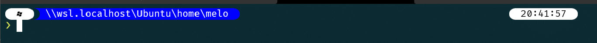
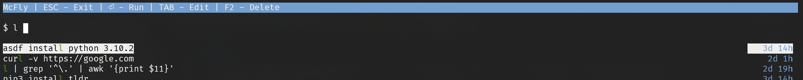
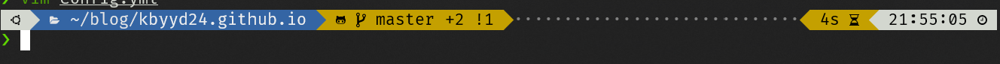

# 重装了 Windows，这些东西又得装一遍


surface 升级到 Windows 11 之后，开始出现莫名其妙的屏闪。在更新驱动也不能改善之后，我还是选择了重装系统。虽然保留了个人数据，但是所有的应用都没有了，不得不重新安装。这里就记录一下那些不管重装多少次系统我都会安装的软件。

# Windows 应用

## Windows Terminal

首先是安装 Windows Terminal。作为一个程序员，当然是无法离开命令行的。而 Windows Terminal 作为巨硬自己开发的工具，是我在 Windows 上体验过的最棒的命令行工具。

可以直接从微软商店下载正式版，也可以从 [GitHub](https://github.com/microsoft/terminal) 上面下载 preview 版本，甚至可以下载源码自己编译。

打开后，使用快捷键 `Ctrl-,` 就能打开图形化的设置页面。为了能有更好的体验，建议做出下面这些修改

1. 修改 `启动 > 默认中端程序`，选择 Windows Terminal
2. 在 powershell 的配置中，把光标修改成实心框。默认的条形光标在 vim 的 visual 模式下非常难以辨认选择了哪些字符

## scoop

既然讲到了 Windows Terminal，那么就继续介绍命令行的工具。

这里要介绍的就是 [scoop](https://scoop.sh/) 这个软件包管理工具。类似于 mac 下的 homebrew，scoop 可以帮助我们管理很多的软件包。我们可以通过它来安装 `git`、`curl` 等常用的 Linux 命令。甚至一些 [Modern Unix](https://github.com/ibraheemdev/modern-unix) 工具也能通过它来安装。

另外，[scoop 还能用来安装 java](https://github.com/ScoopInstaller/Java)，并且可以切换多个版本。这在一定程度上弥补了 [sdkman](https://sdkman.io/install) 无法安装在 Windows 上的遗憾。

除了 scoop，我们在 Windows 上还有一个可选方案就是 [chocolatey](https://chocolatey.org/)。

> 由于重装系统时选择的是保留个人文件，而 scoop 的文件都保存在 `~/scoop` 目录中，所以会遇到 “执行 scoop 命令提示命令不存在，安装 scoop 又会提示 scoop 已经安装” 的问题。这就需要手动删除一下 `~/scoop` 目录重新安装才能解决

## oh-my-posh

[oh-my-posh](https://ohmyposh.dev/) 是一个主题引擎，可以为 bash、zsh 等配置漂亮的主题。当然，powershell 也能够配置。

我们按照官网的介绍，执行下面的命令就可以安装

```powershell
Install-Module oh-my-posh -Scope CurrentUser
```

接着，编辑 `$PROFIEL` 文件，加入一下内容，就可以在下一次启动 powershell 的时候看到美化后的命令行

```powershell
Import-Module oh-my-posh

oh-my-posh --init --shell pwsh --config C:\Users\kbyyd\.oh-my-posh\themes/powerlevel10k_modern.omp.json | Invoke-Expression
```



## VS Code

不必多说，VS Code 绝对是必不可少的编辑器，甚至这篇博客的大部分内容都是在 VS Code 里面完成的。并且在 WSL 中可以直接使用 `code` 命令打开文件或文件夹，十分方便。

## Obsidian

[Obsidian](https://obsidian.md/) 是我用了半年的笔记软件，融合了现代笔记软件的许多优秀功能，比如对卡片记忆法的支持、笔记双联等。

我在众多竞品中选择它，还有这么几个原因：

1. 基于 markdown 语法，几乎没有学习成本。如果能支持 asciidoc 就更好了 :dog:
2. 基于文件系统，所有的内容都保存在我的本地而不是云端，以后要迁移也很方便
3. 可以利用云盘同步，不需要为多设备同步付费
4. 强大的插件系统，除了做笔记，还能用来写日记、做日程安排、做任务管理等

由于 iOS 和 iCloud 的限制，我目前的使用体验算不算完美，但也非常不错了。我现在利用它的 annotator 插件，在 iPad mini 上阅读 PDF 还能做点笔记，然后在 Windows 或者 macOS 下面把这些内容整理到存储在 OneDrive 上的记录知识的 Vault 中。这个 Vault 就是我的知识库了。然后利用 syncthing 同步到 iCloud，就可以在 iOS 上看到整理后的笔记；利用 Folder Sync 同步 OneDrive 就可以在 Android 上阅读同样的内容。

总的来说，Obsidian 非常好的满足了我记录笔记、查阅笔记的需求。如果你不满意现在的笔记软件，Obsidian 值得一试。

## PowerToys

[PowerToys](https://github.com/microsoft/PowerToys) 又是一个巨硬开发的开源工具，它为 Windows 提供了一些小功能来方便我们的使用。

比如使用 FancyZones 来自定义窗口的布局、利用键盘管理器来修改键位和组合键、利用 PowerToys Run 来完成一些快速指令等。

当然，这些功能还比较简单，应付一些复杂的需求可能就无法应对。

比如键盘管理器就过于简单，我们可以用 [AutoHotKey](https://www.autohotkey.com/) 来替换它，完成一些复杂功能。

再比如 PowerToys Run，它只能支持软件中列出来的插件，如果想要扩展，我们可以使用 [Wox](https://github.com/Wox-launcher/Wox) 来自定义各种扩展。

## CopyQ

[CopyQ](https://github.com/hluk/CopyQ) 是一个粘贴板管理工具，可以存储复制过的所有文本和图片。在需要粘贴时，可以搜索所有内容寻找想要的内容。

这还只是它的基础功能。它还可以对所有复制的内容进行编辑、分组等操作，还有更多功能我没有探索过，但这却是是一个强大的软件，比 Windows 自带的 `⊞-v` 强到不知道哪里去了。

## Enable AppContainer Loopback

科学上网是一个合格程序员的必备技能，但是在 Windows 上却有一个困难。那就是按照传统方式安装的程序可以成功使用配置好的科学上网工具上网，但是通过微软商店安装的应用就做不到。

这背后的原因是通过微软商店安装的 UWP 应用运行在一个叫做 AppContainer 的进程中，无法发送流量到本地，也就无法使用本地的代理了。

如果不嫌麻烦的话，可以考虑使用[巨硬官方提供的方法](https://docs.microsoft.com/en-us/windows/iot-core/develop-your-app/loopback)，一步步的去修改注册表。

或者也可以使用 [Enable AppContainer Loopback](https://docs.telerik.com/fiddler/configure-fiddler/tasks/configurefiddlerforwin8) 这个软件来快速完成这个工作。为了方便，我把[下载地址](https://telerik-fiddler.s3.amazonaws.com/fiddler/addons/enableloopbackutility.exe)也放到这里了。

# WSL

因为本身是 Linux，所以这些软件也适用于 Linux，其中一部分还适用于 macOS，可以作为这些系统软件选择的参考。

WSL 的启用和安装就不介绍了，网上已经有很详细的内容，我们直接来看我们要安装什么东西。

## 升级 Ubuntu

我的 WSL 选择的是 Ubuntu（~~后悔了~~），被锁定到了 20.04 TLS 版本。而这个发布时间已经过去很久了，甚至新的 TLS 都快要来了，所以我还是决定先升级一下。

下面的步骤参考的是 [https://askubuntu.com/a/1369686](https://askubuntu.com/a/1369686) 这个回答。

```shell
sudo apt remove snapd # WSL 不支持 systemd，所以 snap 命令也无法成功执行，卸载即可
sudo apt update && sudo apt upgrade
sudo sed -i 's/^Prompt=lts/Prompt=normal/g' /etc/update-manager/release-upgrades
sudo do-release-upgrade
```

完成之后，WSL 会自动重启，Ubuntu 也就升级到了最新的 21.10 版本。

## Homebrew

[Homebrew](https://brew.sh/) 现在支持安装在 Linux 上面了。尤其是我们安装的是 Ubuntu，通过 `apt` 命令安装的软件包往往不是最新版，而 homebrew 正好解决了这个问题。接下来要介绍的几个软件都能够方便的通过 homebrew 安装最新版本。否则还需要到它们的 release page 去下载 `.deb` 文件来安装。

## Modern Unix

[Modern Unix](https://github.com/ibraheemdev/modern-unix) 是有人整理的一些现代化的 unix 命令，是对传统的 unix 命令的优化，提供更便捷的使用方式和更美观的输出，可以极大的提高我们的效率。

下面是我选择的几个命令。

### bat

[bat](https://github.com/sharkdp/bat) 是一个 `cat` 命令的替代品，它可以给输出的文件内容染色，获得更好的阅读体验。除此之外，它还会输出文件名和行号，非常方便阅读。


另外，如果输出的文件是被 `git` 管理的，那么它还能展示出文件的哪些行被删除、新增、修改。

### lsd

[lsd](https://github.com/Peltoche/lsd) 是一个 `ls` 命令的替代品，它可以输出更美观的内容。


还有另一个类型的命令叫做 [exa](https://github.com/ogham/exa)。我之所以选择 `lsd` 是因为它和 `ls` 命令的参数更加接近，所以更容易熟悉起来。

因为平时习惯了敲 `l` 或者 `ls` ，所以我会在 `~/.zshrc` 中配置一下 `alias`

```shell
alias l="lsd -alh"
alias ls="lsd"
```

### delta

[delta](https://github.com/dandavison/delta) 是一个 `diff` 命令的替代品，提供更容易阅读的输出。并且按照 readme 的介绍对 git 进行配置之后，`git diff` 也可以使用 `delta` 来进行输出。

不过遗憾的是，它似乎不能和我非常喜欢的工具 [tig](https://github.com/jonas/tig) 结合起来。

### fd

[fd](https://github.com/sharkdp/fd) 是一个 `find` 命令的替代品，并且比 `find` 命令高效的多，可以更快地得到搜索结果。

### ripgrep

[ripgrep](https://github.com/BurntSushi/ripgrep) 是一个文本搜索工具，可以快速搜索指定文件或目录下地文件内容。

它和上面地 `fd` 命令一样，默认情况下都会忽略掉隐藏文件或者 `.gitignore` 配置地文件。所以用这两个命令来搜索工程项目中地代码引用会十分方便。

比如在一个 Spring 项目中，我们发现 `TicketService` 引用了 `TicketRepository`，如果我们想要在命令行快速找到 `TicketRepository`的路径的话，就可以使用 `fd '^TicketRepository'` 来搜索文件。如果我们想知道哪些类引用了 `TicketService` 的话，就可以使用 `rg '\.TicketService$'` 来搜索。

### mcfly

如果我们想要执行某个之前执行过的命令，我们可以采用下面这些方式

1. 在 zsh 下可以敲出想要的命令的前面几个字符，然后按方向键上，找到想要的命令
2. 通过 `Ctrl-r` 搜索历史
3. 通过 `history | grep` 来查找

这些方式也不是不能用，只是不够高效。[mcfly](https://github.com/cantino/mcfly) 则提供了另一种方式：通过 `Ctrl-r` 搜索历史，并且列出多个可能的结果，方便选择。这比传统方式只能看到一个结果高效多了，完全不用因为看不到想要的结果而担心敲错了内容。



### cheat & tldr

很多命令行的命令，如果不常用的话，我们很难记住应该怎么使用。而且上面介绍的这些命令也需要一个熟悉的过程。如果忘记了一个命令应该如何使用，我们一般可以求助于 `--help` 参数或者 `man`。但是这些内容往往是枯燥的文档，冗长且没有重点。

[cheat](https://github.com/cheat/cheat) 和 [tldr](https://github.com/tldr-pages/tldr) 就可以解决上面的痛点。比如我们不熟悉 `tar` 命令，我们就可以通过 `cheat tar` 或者 `tldr tar` 来查看常用的用法。

这两个命令的不同点在于，`tldr` 有更多的资源，几乎所有的命令都可以通过它来找到。相比之下，`cheat` 命令经常找不到想要的命令。

但是 `cheat` 提供了更多的灵活性：我们可以通过 `cheat -e <command>` 来编辑某个命令的笔记，就像它的名字一样，是属于我自己的小抄。这个小抄的地址，是由配置文件 `$CHEAT_CONFIG_PATH:~/.config/cheat/conf.yml` 指定的。我们可以选择把这个小抄放到自己的云盘上，就可以在多个设备共享这份小抄。

而 `tldr` 想要做到这一点，就需要去提交 PR，通过之后才能被使用。并且这个内容不止对你自己生效，还对所有用户生效。

所以结合使用这两个命令会是一个不错的选择。在 `cheat` 命令无法找到提示时，使用 `tldr` 查看命令，并且把内容保存到 `cheat` 中，方便以后使用。

## oh-my-zsh

当我安装好 Linux 系统后，第一件事情就是安装 `zsh` 并用它替换掉 `bash`。因为 `bash` 的功能实在是太少，而 `zsh` 正好弥补了这一点。

```shell
chsh -s /usr/bin/zsh
```

以 `zsh` 的自动补全功能为例，它可以少敲很多字符，提高效率。比如想进入目录 `src/main/resources`，我不需要敲完整的路径，只需要敲 `cd s/m/r` 然后按下 `tab` 键就可以自动补全了。如果这个路径上有多个符合的路径，那 `zsh` 会在对应的位置停下，我们可以再添加几个字符之后再按 `tab` 来补全。

有了 `zsh` 自然时不能少了 [oh-my-zsh](https://ohmyz.sh/) 的，它主要提供了命令行美化和插件管理的功能。

### 主题

主题的话我会推荐 [powerlevel10k](https://github.com/romkatv/powerlevel10k)。它默认的展示信息足够详细，非常方便我们直接获取信息，而不需要执行命令。比如下面的截图中，我们就能看到当前 git repo 的状态、上一个命令消耗的时间和当前的时间。另外，它还能显示 aws profile、k8s config 等信息。



当然，想要这样的效果，还需要安装 powerlevel10k 支持的[字体](https://github.com/romkatv/powerlevel10k#fonts)。这些字体需要安装到 Windows 下，然后在 Windows Terminal 的配置中选择想要的字体。

### 插件

`oh-my-zsh` 提供了很多内置插件，也有其他插件可以选择安装。这里推荐几个我常用的插件。

- git
	- 这个插件提供了常用的 git 命令的 alias，熟悉之后能够更快的执行这些命令
- z
	- 通过 `z` 命令可以快速跳转访问过的目录
- zsh-autosuggestions
	- 根据键入的字符匹配上一次执行过的命令并提示出来，如果是想要的命令，可以直接按方向右键补全
- zsh-syntax-highlighting
	- 用红色和绿色提示想要执行的命令是否存在
- gradle
	- 为 gradle 项目生成 task 列表缓存，方便使用 `tab` 补全

## tmux

我是从去年开始入坑 [tmux](https://github.com/tmux/tmux) 的，因为它能解决我的一个痛点，那就是不得不重启电脑的时候，打开的命令行会话就会丢失，需要靠人力一个个找回来。

tmux 本身并不解决这个问题，它实际上只是一个终端管理器，会启动一个 server 来管理会话，使用 client 连接 server 来使用 会话。而在我的使用场景中，server 也运行在我的笔记本上面，所以重启电脑也会关闭 server，会话也就丢失了。

好在，tmux 支持安装插件，而 [Tmux Resurrect](https://github.com/tmux-plugins/tmux-resurrect) 插件就可以满足会话保存和恢复的需求。安装插件后，我们可以在重启电脑前使用 `prefix + Ctrl-s` 保存当前会话，重启电脑后使用 `prefix + Ctrl-r` 恢复会话。

如果你觉得每次重启前后都需要按键来操作比较麻烦的话，[tmux-continuum](https://github.com/tmux-plugins/tmux-continuum) 插件可以帮助到你。它可以每15分钟自动保存一次会话，并且在 server 启动时自动恢复会话。这样就省去了每次重启前后的操作。

### oh-my-tmux

[oh-my-tmux](https://github.com/gpakosz/.tmux) 之于 tmux，就像 oh-my-zsh 之于 zsh 一样，为 tmux 做了很多美化和扩展的工作。如果你使用 tmux，那么 oh-my-tmux 绝对值得一试。

安装 oh-my-tmux 之后，可以直接使用 `prefix + e` 来编辑配置文件，退出时 tmux 会自动更新配置。

现在让我来配置一下 oh-my-tmux。

首先是修改 `prefix`。tmux 默认的 `prefix` 是 `Ctrl-b`，在我看来这并不容易按到。并且我很容易随手 `Ctrl-d` 退出会话，所以为了避免意外地退出，我干脆把 `prefix` 绑定到了 `Ctrl-d`。

```shell
set -g prefix 'C-d'
unbind C-b
bind 'C-d' send-prefix
```

接着是让鼠标可以直接滚动我的终端。tmux 中默认情况下我们是不能使用鼠标滚动查看那些滚出屏幕地内容的。所以我们需要做一点配置来让我们可以使用鼠标滚动屏幕。

```shell
set-option -g mouse on
bind -n WheelUpPane if-shell -F -t = "#{mouse_any_flag}" "send-keys -M" "if -Ft= '#{pane_in_mode}' 'send-keys -M' 'select-pane -t=; copy-mode -e; send-keys -M'"  
bind -n WheelDownPane select-pane -t= \; send-keys -M 
```

最后是配置插件了，在使用 oh-my-tmux 后，插件的配置方式有点不一样，需要用下面的方式来配置。

```shell
set -g @tpm_plugins '          \
  tmux-plugins/tpm             \
  tmux-plugins/tmux-sensible   \
  tmux-plugins/tmux-resurrect  \
  tmux-plugins/tmux-continuum  \
'
```

## vim 配置

我并不是一个 vim 党，但是常年在命令行活动，难免不和 vim 打交道。

首先是插件，我一定会选择的是 [vim-airline](https://github.com/vim-airline/vim-airline) 和 [vim-airline-themes](https://github.com/vim-airline/vim-airline-themes)。它们是用来在 vim 的底部展示一行信息，包括了当前的模式、编辑的文件名、文件的状态、文件的语言、所处的行等信息。并且有很多的主题配色可供选择。毕竟好看是第一生产力，谁能忍受原始的 vim 那个简陋的界面呢。

接着要让我们的鼠标能够控制 vim 滚动，否则就得靠 `Ctrl-e` 和 `Ctrl-y` 来滚动

```vim
set mouse=a
if has("mouse_sgr")
  set ttymouse=sgr
else
  set ttymouse=xterm2
end
```

最后是打通 vim 的注册器和系统的粘贴板，WSL 中的配置有所不同

```vim
autocmd TextYankPost * call system('echo '.shellescape(join(v:event.regcontents, "\<CR>")).' |  clip.exe')
" for macOS
"set clipboard=unnamed
```

## direnv

[direnv](https://github.com/direnv/direnv) 可以在我们进入到某个目录的时候自动帮我们设置一些环境变量，这对于用来工作的电脑来说非常实用。

我会在项目的根目录下创建一个 `.envrc` 文件，在里面可以配置 gradle 的缓存目录、kubernetes config 文件路径、aws profile 等环境变量。这样在进入这个目录或它的子目录后，都可以使用这些配置。而在离开这个目录的时候，又会自动 `unset` 这些环境变量，采用默认值。

---

这些就是我目前在使用的一部分工具，把它们记录在这里，下次重装系统就不用担心忘掉什么了。

